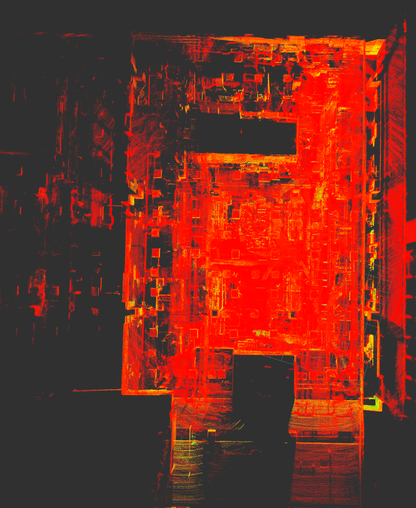

# Instruction of Setting Up DLIO on Jackal

This repo makes essential modifications to deploy DLIO on Jackal (default: Jackal2) used in [ERL](https://existentialrobotics.org). Here is an example of the deskewed points output by DLIO on Jackal:


Unless the Jackal robot has its configuration changed, the modification in this repo is correct. So, this repo should be ready to use for Jackal.

Here are the modifications:

## 1. Specify the frame name to publish in `cfg/params.yaml`

```
dlio:

  frames:
    odom: odom
    baselink: dlio/base_link  # name of the base link frame to publish
    lidar: dlio/os_sensor  # name of the lidar frame to publish
    imu: dlio/os_imu  # name of the imu frame to publish
```

## 2. Specify the static transformations from base_link to LiDAR/IMU

The LiDAR frame path should be the one in the point cloud message.

```
dlio:
  extrinsics:
    baselink2imu:  # e.g. rosrun tf tf_echo jackal2/base_link jackal2/os_sensor
      t: [ -0.126, 0.012, 0.306 ]
      R: [ -1.,  0.,  0.,
           0.,  -1.,  0.,
           0.,  0.,  1. ]
    baselink2lidar:  # e.g. rosrun tf tf_echo jackal2/base_link jackal2/os_imu
      t: [ -0.120, 0.0, 0.335 ]
      R: [ 1.0, 0.0, 0.0,
           0.0, 1.0, 0.0,
           0.0, 0.0, 1.0]
```

## 3. Bridge frames in the TF tree

Two static transformations are added in `launch/dlio.launch` to bridge the frames between DLIO and Jackal:

```
<!-- Static transform from odom to robot_namespace/odom -->
<node name="odom_tf_broadcaster" pkg="tf2_ros" type="static_transform_publisher" args="0 0 0 0 0 0 odom $(arg robot_namespace)/odom" />
<!-- Static transform from robot_namespace/base_link to robot_namespace/dlio/base_link -->
<node name="base_link_tf_broadcaster" pkg="tf2_ros" type="static_transform_publisher" args="0 0 0 0 0 0 $(arg robot_namespace)/dlio/base_link $(arg robot_namespace)/base_link" />
```

# Direct LiDAR-Inertial Odometry: Lightweight LIO with Continuous-Time Motion Correction

#### [[ IEEE ICRA ](https://ieeexplore.ieee.org/document/10160508)] [[ arXiv ](https://arxiv.org/abs/2203.03749)] [[ Video ](https://www.youtube.com/watch?v=4-oXjG8ow10)] [[ Presentation ](https://www.youtube.com/watch?v=Hmiw66KZ1tU)]

DLIO is a new lightweight LiDAR-inertial odometry algorithm with a novel coarse-to-fine approach in constructing continuous-time trajectories for precise motion correction. It features several algorithmic improvements over its predecessor, [DLO](https://github.com/vectr-ucla/direct_lidar_odometry), and was presented at the IEEE International Conference on Robotics and Automation (ICRA) in London, UK in 2023.

<br>
<p align='center'>
    
</p>

## Instructions

### Sensor Setup & Compatibility
DLIO has been extensively tested using a variety of sensor configurations and currently supports Ouster, Velodyne, Hesai, and Livox LiDARs. The point cloud should be of input type `sensor_msgs::PointCloud2` and the 6-axis IMU input type of `sensor_msgs::Imu`.

For Livox sensors specifically, you can use the `master` branch directly if it is of type `sensor_msgs::PointCloud2` (`xfer_format: 0`), or the `feature/livox-support` branch and the latest [`livox_ros_driver2`](https://github.com/Livox-SDK/livox_ros_driver2) package if it is of type `livox_ros_driver2::CustomMsg` (`xfer_format: 1`) (see [here](https://github.com/vectr-ucla/direct_lidar_inertial_odometry/issues/5) for more information).

For best performance, extrinsic calibration between the LiDAR/IMU sensors and the robot's center-of-gravity should be inputted into `cfg/dlio.yaml`. If the exact values of these are unavailable, a rough LiDAR-to-IMU extrinsics can also be used (note however that performance will be degraded).

IMU intrinsics are also necessary for best performance, and there are several open-source calibration tools to get these values. These values should also go into `cfg/dlio.yaml`. In practice however, if you are just testing this work, using the default ideal values and performing the initial calibration procedure should be fine.

Also note that the LiDAR and IMU sensors _need_ to be properly time-synchronized, otherwise DLIO will not work. We recommend using a LiDAR with an integrated IMU (such as an Ouster) for simplicity of extrinsics and synchronization.

### Dependencies
The following has been verified to be compatible, although other configurations may work too:

- Ubuntu 20.04
- ROS Noetic (`roscpp`, `std_msgs`, `sensor_msgs`, `geometry_msgs`, `nav_msgs`, `pcl_ros`)
- C++ 14
- CMake >= `3.12.4`
- OpenMP >= `4.5`
- Point Cloud Library >= `1.10.0`
- Eigen >= `3.3.7`

```sh
sudo apt install libomp-dev libpcl-dev libeigen3-dev
```

DLIO supports ROS1 by default, and ROS2 using the `feature/ros2` branch.

### Compiling
Compile using the [`catkin_tools`](https://catkin-tools.readthedocs.io/en/latest/) package via:

```sh
mkdir ws && cd ws && mkdir src && catkin init && cd src
git clone https://github.com/vectr-ucla/direct_lidar_inertial_odometry.git
catkin build
```

### Execution
After compiling, source the workspace and execute via:

```sh
roslaunch direct_lidar_inertial_odometry dlio.launch \
  rviz:={true, false} \
  pointcloud_topic:=/robot/lidar \
  imu_topic:=/robot/imu
```

for Ouster, Velodyne, Hesai, or Livox (`xfer_format: 0`) sensors, or

```sh
roslaunch direct_lidar_inertial_odometry dlio.launch \
  rviz:={true, false} \
  livox_topic:=/livox/lidar \
  imu_topic:=/robot/imu
```

for Livox sensors (`xfer_format: 1`).

Be sure to change the topic names to your corresponding topics. Alternatively, edit the launch file directly if desired. If successful, you should see the following output in your terminal:
<br>
<p align='center'>
    
</p>

### Services
To save DLIO's generated map into `.pcd` format, call the following service:

```sh
rosservice call /robot/dlio_map/save_pcd LEAF_SIZE SAVE_PATH
```

### Test Data
For your convenience, we provide test data [here](https://drive.proton.me/urls/Z83QCWKZWW#bMIqDh02AJZZ) (1.2GB, 1m 13s, Ouster OS1-32) of an aggressive motion to test our motion correction scheme, and [here](https://drive.proton.me/urls/7NQSK9DXJ0#gZ9yjGNrDBgG) (16.5GB, 4m 21s, Ouster OSDome) of a longer trajectory outside with lots of trees. Try these two datasets with both deskewing on and off!

<br>
<p align='center'>
    
</p>

## Citation
If you found this work useful, please cite our manuscript:

```bibtex
@article{chen2022dlio,
  title={Direct LiDAR-Inertial Odometry: Lightweight LIO with Continuous-Time Motion Correction},
  author={Chen, Kenny and Nemiroff, Ryan and Lopez, Brett T},
  journal={2023 IEEE International Conference on Robotics and Automation (ICRA)},
  year={2023},
  pages={3983-3989},
  doi={10.1109/ICRA48891.2023.10160508}
}
```

## Acknowledgements

We thank the authors of the [FastGICP](https://github.com/SMRT-AIST/fast_gicp) and [NanoFLANN](https://github.com/jlblancoc/nanoflann) open-source packages:

- Kenji Koide, Masashi Yokozuka, Shuji Oishi, and Atsuhiko Banno, “Voxelized GICP for Fast and Accurate 3D Point Cloud Registration,” in _IEEE International Conference on Robotics and Automation (ICRA)_, IEEE, 2021, pp. 11 054–11 059.
- Jose Luis Blanco and Pranjal Kumar Rai, “NanoFLANN: a C++ Header-Only Fork of FLANN, A Library for Nearest Neighbor (NN) with KD-Trees,” https://github.com/jlblancoc/nanoflann, 2014.

We would also like to thank Helene Levy and David Thorne for their help with data collection.

Many thanks to [@shrijitsingh99](https://github.com/shrijitsingh99) for [porting DLIO to ROS2](https://github.com/vectr-ucla/direct_lidar_inertial_odometry/pull/16)!

## License
This work is licensed under the terms of the MIT license.

<br>
<p align='center'>
    
</p>
<p align='center'>
    
</p>
